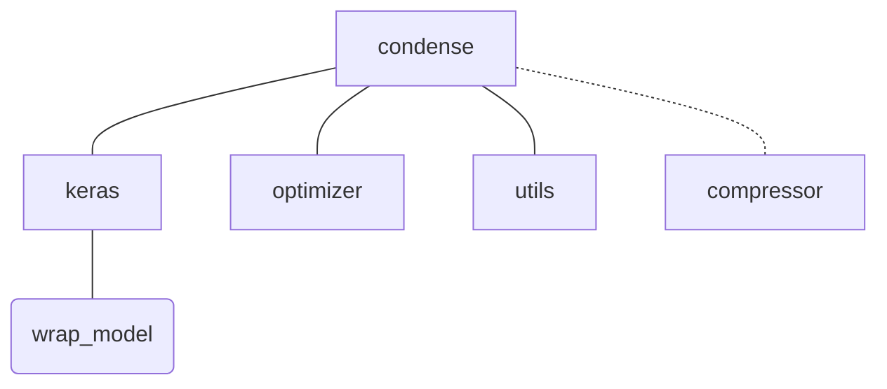

# Condense Module

## keras (`condense.keras`)
Use this module if you have a keras model that you want to optimize or train an optimized model from scratch.

### Using the Pruning Wrapper Layer (`condense.keras.PruningWrapper`)
The first step is to apply `condense.keras.PruningWrapper` to every layer you want to prune.
For ease of use you can use `condense.keras.wrap_model(model, sparsity_fn)`. 
This function wraps every compatible layer of the reference model `model` into a new augmented model.  
Non compatible layers will be ignored and a warning displayed. (A list of compatible layers can be found under `condense.keras.support`)

> **Warning**  
> Please note that the returned model is NOT a deepcopy of the original model.

### Sparsity Function (`condense.optimizer.sparsity_functions.SparsityFunction`)
`SparsityFunction` is an abstract class and implementations have to implement the `get_epoch_sparsity` abstract method.
The `get_epoch_sparsity` function should return the target sparsity for every epoch during training. 

#### Implementations
- `Constant` (`condense.optimizer.sparsity_functions.Constant`)  

  A constant target sparsity over the duration of training.

- `Linear` (`condense.optimizer.sparsity_functions.Linear`)  

  A linear increase in target sparsity over the course of training.

#### Usage
`new_model = wrap_model(model, sparsity_fn=condense.optimizer.sparsity_functions.Linear(0.8))` 

