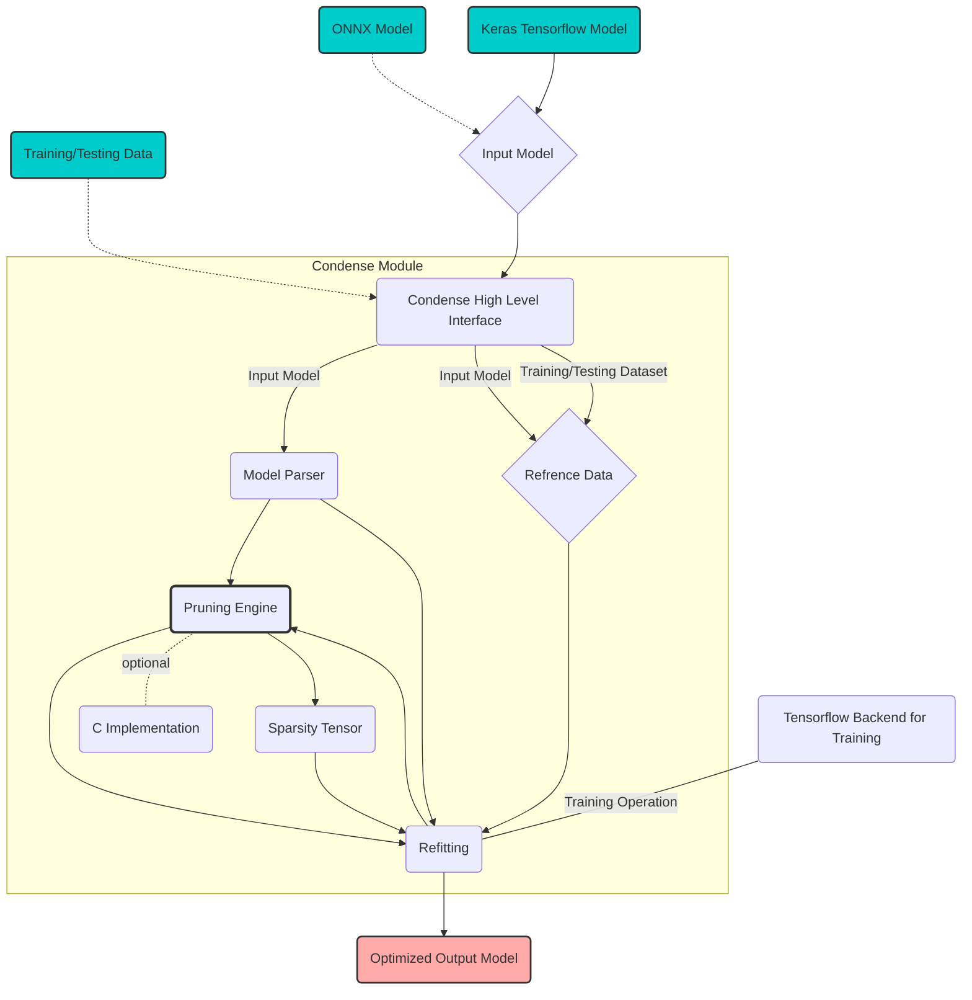
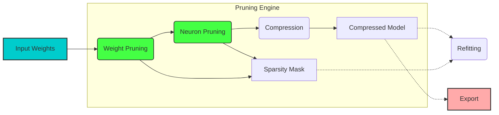

# Project Structure

## Component Diagramm

```mermaid
graph TD
    style onnx fill:#0cc,stroke:#333,stroke-width:2px
    style t_data fill:#0cc,stroke:#333,stroke-width:2px
    style keras fill:#0cc,stroke:#333,stroke-width:2px
    style output fill:#faa,stroke:#333,stroke-width:2px
        style pruning stroke:#333,stroke-width:3px
    onnx(ONNX Model) -.-> model
    keras(Keras Tensorflow Model) --> model
    model{Input Model} --> highlevel(Condense High Level Interface)
    t_data(Training/Testing Data) -.-> highlevel 
    refrence --> training
    
    subgraph condense [Condense Module]
        refrence{Refrence Data}
        highlevel --Input Model--> parser(Model Parser)
        parser --> pruning(Pruning Engine) --> training
        parser --> training
        training(Refitting) --> pruning
        pruning -.-|optional| c(C Implementation)
        pruning --> mask(Sparsity Tensor)
        mask --> training
    end

    highlevel --Input Model--> refrence
    highlevel --Training/Testing Dataset--> refrence
    training --> output(Optimized Output Model)
    
    tf(Tensorflow Backend for Training) ---|Training Operation| training
```

## Pruning Engine

```mermaid
graph LR
    style input fill:#0cc,stroke:#333,stroke-width:2px
    style export fill:#faa,stroke:#333,stroke-width:2px
    style neuron_pruning fill:#4f4,stroke:#333,stroke-width:1.5px
    style weight_pruning fill:#4f4,stroke:#333,stroke-width:1.5px

    subgraph module [Pruning Engine]
        weight_pruning(Weight Pruning) --> 
        neuron_pruning(Neuron Pruning) -->
        compression(Compression)
        neuron_pruning --> mask[Sparsity Mask]
        weight_pruning --> mask[Sparsity Mask]
    compression --> compressed_model[Compressed Model]
    end

    input[Input Weights] --> weight_pruning
    compressed_model -.-> refitting(Refitting)
    mask -.-> refitting
    compressed_model -.-> export[Export]
```
